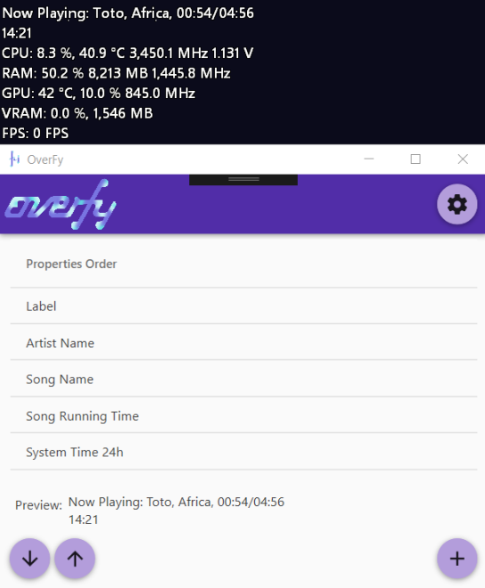
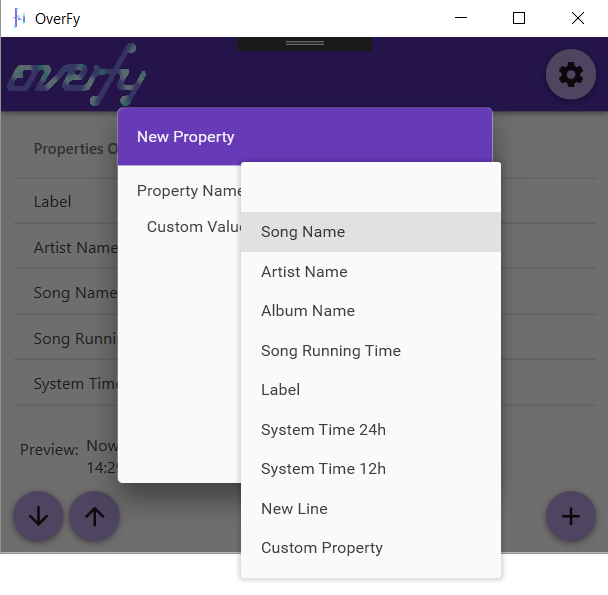

# OverFy
### Spotify Status for Rivatuner Statistics Server Overlay

***

Welcome to OverFy, a simple way to add information about the song you are listening on Spotify to into Rivatuner Statistics Server!

> Application UI is subject to changes, but overall functionality should remain the same.

This app **NEEDS** [RivaTuner Statistics Server](http://www.guru3d.com/files-details/rtss-rivatuner-statistics-server-download.html) or [MSI Afterburner](https://www.msi.com/page/afterburner) and [Spotify Desktop](https://www.spotify.com/br/download/windows/) in order to work correctly.

It features many properties to be displayed into your overlay while you play your games, including:
- Song Title
- Artist Name
- Album Name 
- Current Song Running Time
- System Time in 12 or 24 Hour Format
- Customizable Values

And more could be added if needed.

To use, simply [download the latest zip from the releases page](https://github.com/BrianLima/OverFy/releases), extract it somewhere in your PC, and run the main EXE.

> OverFy needs admin rights in order to check if Rivatuner is running and try to launch it when it's not.

Then, click at the plus button on the bottom right of the screen:

Choose the property you want to be displayed on screen:

Click on "Add", reorder the properties as you wish, and game on!

There is a Dark mode on the "About" section of the app and an "Auto Start" too.

Unfortunately i still haven't found a way to force OverFy to write to the screen before or after Afterburner or [HWiNFO](https://www.hwinfo.com/download.php), from my tests, the order seems to be based on launch order.

This is a FREE open source software licensed under the [MIT License](LICENSE), if you like my work, you can follow me on [Twitter](https://twitter.com/brianostorm) or pay me a coffee via [Paypal](https://www.paypal.com/cgi-bin/webscr?cmd=_s-xclick&hosted_button_id=9YPV3FHEFRAUQ) or [Bitcoin](https://blockchain.info/pt/address/174LnSVCdrX4CnVS84jom7by2hMBGvJobm) as it will fuel me while i develop other tools for you!

Also, check my other projects:

- [UWPHook: Add Windows Store games to Steam](https://brianlima.github.io/UWPHook/)
- [HueHue: LED controller for Windows and Arduino](https://github.com/BrianLima/HueHue)

